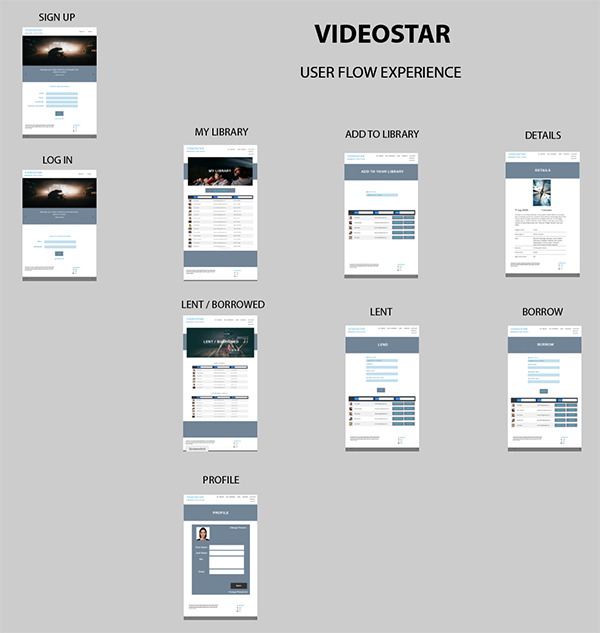
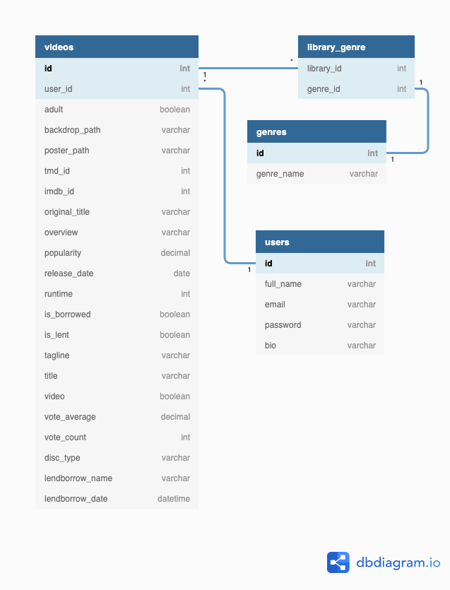

# VideoStar - A Full Stack React App

This application is specially designed for video collectors and keep track of all the videos in their collection. 

* The user can search for movies in [TMDB (The Movie Database)](https://www.themoviedb.org/?language=en-US) and add them to their collection. 
* After a search in TMDB, the user gets a table of movies with the results of the search term.
* The search results table from TMDB show information about each movie: 
    ** poster image
    ** movie title
    ** synopsis
    ** popularity
    ** realease date
* The search results table from TMDB, allows the user to click on the Details button to get more details about a specific movie.
* The search results table from TMDB, allows the user to click on the 3 Add buttons (`Add Blu-Ray`, `Add DVD`, `Add Digital`) to save the specific movie in their collection as Blu-Ray, DVD or Digital format.
* The collection can be of 3 different types of videos: Blu-Ray, DVD or Digital. 
* The user can save their videos as physical Blu-Ray and DVD or as digital format.
* The user can lend videos to other people and can specify to whom, the lending date and the agreed return date.
* The user can borrow videos from other people and can specify from whom, the borrowing date and the agreed return date.
* To use the app the user must signup for a free account or login with its credentials.
* To signup, the user is required to provide a name, a valid email address and a password.
* To login, the user only needs to provide a valid email and password. 
* The user session is controlled with a [JWT (JSON Web Token)](https://jwt.io/) stored in the browser's [Window.sessionStorage](https://developer.mozilla.org/en-US/docs/Web/API/Window/sessionStorage).
* The user has a profile that can be updated.
* Once authenticated, the user has access to all the features in the app.
* Users that are not authenticated can not access any resources.

This is a Full Stack application that follows the [MVC (Model View Controller)](https://en.wikipedia.org/wiki/Model%E2%80%93view%E2%80%93controller) software design pattern. This app uses: 
* [React JS](https://reactjs.org/) is the front-end library that is acting as the __View__.
* [Express JS](https://expressjs.com/) is the web server that is acting as the __Controller__.
* [MySQL](https://www.mysql.com/) is the database server that is acting as the __Model__.

This app contains React components, helper/util functions, and uses React lifecycle methods to query and display books based on user searches. Node, Express and MongoDB are used in the backend so that users can save books to review or purchase later.

- - -
## Deployed App in Heroku

[VideoStar in Heroku](https://video-star.herokuapp.com/)
- - -

## GitHub Repository

[VideoStar in GitHub](https://github.com/zackapotamus/video-star)

- - -

## App Mockup Screenshots

__Login and Signup Pages__           

__My Library and Lent/Borrowed Pages__

__Add To Library and Details Page__

__Lend and Borrow Pages__

__Account Page__

__User Experience Flow Mockup__

__Relational Database Design Mockup__

- - -
## Real App Screenshots

__Login and Signup Pages__           

--->

__My Library and Lent/Borrowed Pages__

--->

__Add To Library and Details Page__

--->

__Lend and Borrow Pages__

--->

__Account Page__

- - -
## Technologies Used in VideoStar

* [HTML (Hypertext Markup Language)](https://en.wikipedia.org/wiki/HTML). The standard markup language for documents designed to be displayed in a web browser. 
* [CSS (Cascading Style Sheets)](https://www.w3schools.com/css/css_intro.asp). CSS describes how HTML elements are to be displayed on screen, paper, or in other media.
* [Javascript](https://developer.mozilla.org/en-US/docs/Web/JavaScript). A lightweight, interpreted, or just-in-time compiled programming language with first-class functions. It is the scripting language for Web pages, although many non-browser environments also use it (Node.js, Apache CouchDB and Adobe Acrobat). JavaScript is a prototype-based, multi-paradigm, single-threaded, dynamic language, supporting object-oriented, imperative, and declarative (e.g. functional programming) styles.
* [jQuery](https://jquery.com/). It is a JavaScript library that makes things like HTML document traversal and manipulation, event handling, animation, and Ajax much simpler with an easy-to-use API that works across a multitude of browsers.
* [Bootstrap](https://getbootstrap.com/). The world’s most popular front-end open source toolkit to quickly design and customize responsive mobile-first sites.

* [Nodejs](https://nodejs.org/en/)
* [npm Packages](https://www.npmjs.com/)
    * [Expressjs](https://www.npmjs.com/package/express). As a web server.
    * [Mysql](https://www.npmjs.com/package/mysql). As a driver for mysql. 
    * [Axios](https://www.npmjs.com/package/axios). Promise based HTTP client for the browser and node.js
    * [Bcryptjs](https://www.npmjs.com/package/bcrypt). A library to help hash passwords.
    * [Dotenv](https://www.npmjs.com/package/dotenv). Loads environment variables from a `.env` file into `process.env`. Storing configuration in the environment separate from code is based on The [Twelve-Factor App methodology](https://12factor.net/).
    * [If-env](https://www.npmjs.com/package/if-env). To simplify npm scripts.
    * [JSON Web Token](https://www.npmjs.com/package/jsonwebtoken). Open industry standard (RFC 7519) method for representing claims securely between two parties.
    * [Sequelize](https://www.npmjs.com/package/sequelize). A promise-based Node.js [ORM (Object-Relational Mapping)](https://en.wikipedia.org/wiki/Object-relational_mapping) for Postgres, MySQL, MariaDB, SQLite and Microsoft SQL Server. It features solid transaction support, relations, eager and lazy loading, read replication and more.
    * [Concurrently](https://www.npmjs.com/package/concurrently). For development purposes only. Instead of running all commands in separate terminals, we can use concurrently, which allows to run multiple commands concurrently. 
    * [Nodemon](https://www.npmjs.com/package/nodemon). For development purposes only. It automatically restarts the node application when file changes in the directory are detected.
    * [Moment](https://www.npmjs.com/package/moment). Library for parsing, validating, manipulating, and formatting dates.
    * [React](https://www.npmjs.com/package/react). A library for creating user interfaces.
    * [React DOM](https://www.npmjs.com/package/react-dom). The entry point to the DOM and server renderers for React. 
    * [React Icons](https://www.npmjs.com/package/react-icons). Utilizes ES6 imports that allows you to include only the icons that your project is using.
    * [React Router DOM](https://www.npmjs.com/package/react-router-dom). DOM bindings for React Router.
    * [React Scripts](https://www.npmjs.com/package/react-scripts). Configuration and scritps for Create React App
    * [React Toast Notifications](https://www.npmjs.com/package/react-toast-notifications). A configurable, composable, toast notification system for react.
    * [Read More React](https://www.npmjs.com/package/read-more-react). It "intelligently" truncates text at the appropriate point given a min, an ideal, and max text length. 

* [The Movie Database API](https://developers.themoviedb.org/3/getting-started/introduction). 

* [Create React App](https://create-react-app.dev/). Sets up a modern React web app by running one command.

* [Full CRUD Operations](https://en.wikipedia.org/wiki/Create,_read,_update_and_delete). Create, read, update, and delete are the 4 basic functions of persistent storage.

* [Heroku](https://heroku.com). A cloud application platform to host web apps. It is a Platform as a Service (PaaS) that enables developers to build, run, and operate applications entirely in the cloud.

* [MVC (Model-View-Controller)](https://en.wikipedia.org/wiki/Model%E2%80%93view%E2%80%93controller). This app follows the MVC paradigm, a software design pattern commonly used for developing user interfaces which divides the related program logic into 3 interconnected elements.

* [Environment Variables](https://en.wikipedia.org/wiki/Environment_variable). An environment variable is a variable whose value is set outside the program, typically through functionality built into the operating system or microservice. An environment variable is made up of a name/value pair, and any number may be created and available for reference at a point in time.

* [Adobe Illustrator](https://www.adobe.com/products/illustrator.html). The state of the art in illustration. A vector-based graphics software that scales down for mobile screens and up to billboard size. The results always look crisp and beautiful.

* [Adobe Photoshop](https://www.adobe.com/products/photoshop.html). A photo editor to create and enhance photos, images, and designs.

* [Trello](https://trello.com/). A visual tool for organizing your work and life. It is an excellent lightweight project management tool. It is easy on the eye and relatively straightforward to use.

* [MySQL Workbench](https://www.mysql.com/products/workbench/). A unified visual tool for database architects, developers, and DBAs.

* [Postman](https://www.postman.com/). The Collaboration Platform for API Development. Quickly and easily send REST, SOAP, and GraphQL requests directly within Postman.

* [Slack](https://slack.com/). Slack brings the team together, wherever you are. With all of your communication and tools in one place, remote teams will stay productive no matter where you’re working from.

* [Zoom](https://zoom.us/). Unifies cloud video conferencing, simple online meetings, and group messaging into one easy-to-use platform. 

* [Google Meet](https://meet.google.com/). Premium video meetings in the browser.
- - - 
## Coding Requirements

This application has the following requirements:

* Must use [React JS](https://reactjs.org/)
* Must use [Node](https://nodejs.org/en/) and [Express JS](https://expressjs.com/) Web Server
* Must be backed by a database, like [MySQL](https://www.mysql.com/) or [MongoDB](https://www.mongodb.com/)
* Must use a [ORM (Object-Relational Mapping)](https://en.wikipedia.org/wiki/Object-relational_mapping) like [Sequelize](https://sequelize.org/) or a [ODM](https://www.tutorialspoint.com/phalcon/phalcon_object_document_mapper.htm) like [Mongoose](https://mongoosejs.com/)
* Must have full [CRUD](https://en.wikipedia.org/wiki/Create,_read,_update_and_delete) routes for retrieve, add, update and delete data.
* Must be deployed in Heroku with data.
* Must use at least 2 new libraries, packages or technologies.
* Must use user authentication
* Must have a polished font end user interface.
* Must follow the MVC paradigm
* Must follow best practices for directory structure.
* Must follow good quality coding standards (indentation, scope, naming conventions, etc).
* Must use an external API call.
* Must hide the API key with environment variables.
* Must hide sensitive information from the public. 